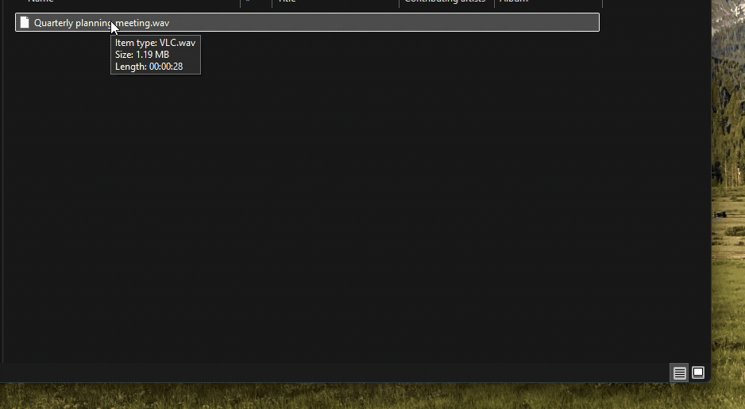
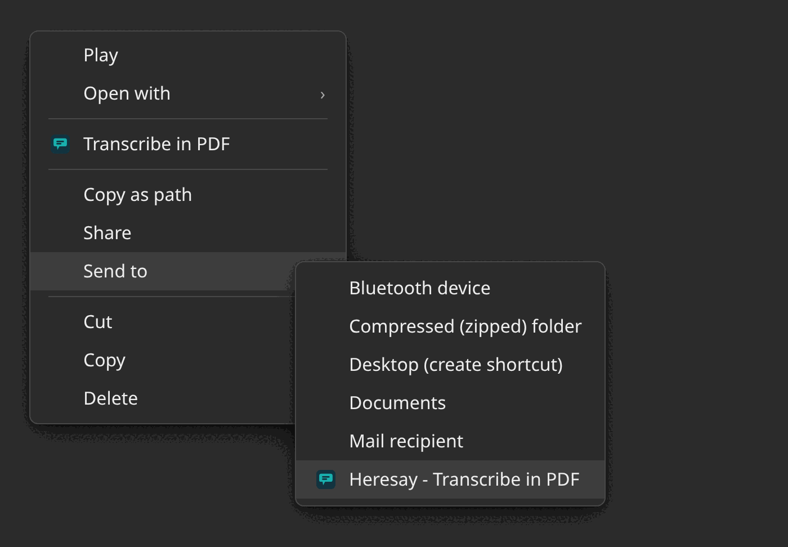
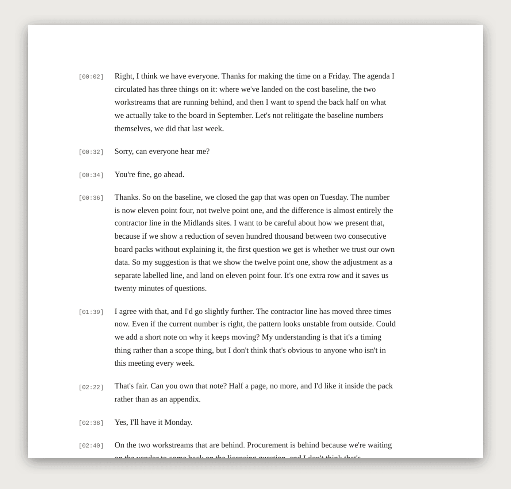
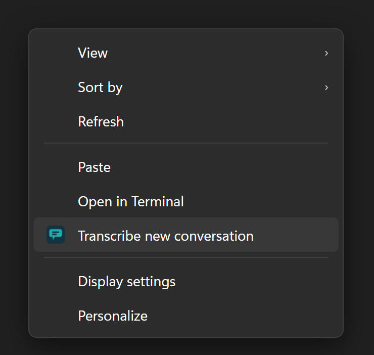
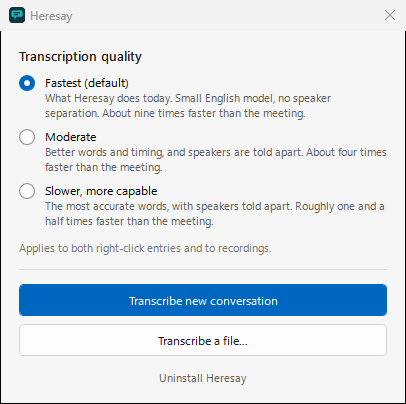

# Heresay



**Audio and video to speaker-labeled transcripts on your PC.**

The name is *here + say*: your recordings stay here.

Heresay turns meeting recordings into timestamped, speaker-labeled PDF transcripts. Everything runs on your own computer — no audio is ever uploaded anywhere.

---

## What it does

- **Right-click any recording** → transcript PDF appears next to the file.
- **Record a live meeting** → right click on your desktop, system audio and microphone captured together and transcribed.
- **Three quality levels** — from a fast English-only model to a slower multilingual one with speaker separation.

---

## Features

### Transcribe a file

Right-click any audio or video file in File Explorer and choose **Transcribe in PDF**. A progress window opens and shows a live ETA. When it finishes, the transcript PDF is saved next to the source file.



Supported formats include MP3, M4A, MP4, WAV, OGG, FLAC, MKV, WEBM, and [many more](app/Register-ShellVerbs.ps1).

The output is a paginated PDF with timestamps and, at the two higher quality levels, speaker labels:



### Record a conversation

Right-click an empty part of your desktop — or the background of any open folder — and choose **Transcribe new conversation**.



Heresay captures both your microphone and the audio playing through your speakers simultaneously, then transcribes the combined recording when you stop. Works with Zoom, Teams, and any other call. The same entry is also on the **Transcribe new conversation** button in the home window.

> If your default microphone is a Bluetooth headset, Heresay automatically uses a wired or built-in microphone instead — opening a Bluetooth hands-free mic forces the earbuds into mono phone quality, which degrades the whole recording. If no alternative exists, it falls back to the Bluetooth mic with a note in the log.

### Choose a quality level

Open the Heresay home window (Start → search "Heresay") to pick how carefully Heresay listens. The setting applies to every path — both right-click entries and the file button.



| Level | Speed | Speakers | Language |
|---|---|---|---|
| **Fastest** *(default)* | ~9× faster than real-time | No | English |
| **Moderate** | ~4× faster | Yes — labeled by speaker | English |
| **Slower, more capable** | ~1.5× faster | Yes — labeled by speaker | Auto-detects (English, Spanish, and more) |

The window also has a **Transcribe a file…** button that opens a file picker, and an **Uninstall Heresay** link at the bottom.

---

## What the installer does

[`Install-Heresay.vbs`](Install-Heresay.vbs) is the complete 927-line installer; read it before you run it.

1. It decodes its comment-only, base64 package into a fresh `%TEMP%\Heresay-Setup-*` folder and starts `installer\Install-Gui.ps1`. The temporary folder and bootstrap `.ps1` may remain after setup closes.
2. If PowerShell 7 is missing, it downloads the pinned Microsoft release from GitHub, verifies its SHA256, and installs it under `%LOCALAPPDATA%\Programs\PowerShell7`.
3. It downloads approximately 2.7 GB of SHA256-pinned components: whisper.cpp, ffmpeg, and sherpa-onnx releases from GitHub; NAudio from NuGet; and speech, diarization, and VAD models from GitHub and Hugging Face. The exact versions, URLs, sizes, and hashes are in [`contracts/download-manifest.json`](contracts/download-manifest.json).
4. It caches downloads under `%LOCALAPPDATA%\TranscribeIt\downloads` and installs the app, models, binaries, configuration, logs, manifest, and uninstaller under `%LOCALAPPDATA%\Programs\TranscribeIt`.
5. It creates the per-user Start Menu shortcut and shell verbs under `HKCU\Software\Classes`: `SystemFileAssociations\.<extension>\shell\TranscribeIt` for media files, plus `DesktopBackground\Shell\HeresayRecordConversation` and `Directory\Background\shell\HeresayRecordConversation` for recording a conversation.
6. Everything is per-user. It does not write to HKLM or `C:\Program Files`, request elevation, or require administrator rights.

The installer is unsigned. That is why Windows may show a SmartScreen warning; reading the source and checking its hash are the available mitigations.

Release notes publish SHA256 checksums for release assets. To verify the installer you downloaded:

```powershell
Get-FileHash .\Install-Heresay.vbs -Algorithm SHA256
```

---

## Install

### New install

1. Go to the [Releases page](https://github.com/villenull/Heresay/releases/latest) and download **`Install-Heresay.vbs`**.
2. Double-click the file. A setup window opens after a few seconds while the package downloads.
3. Click **Install**. The first install downloads approximately 2.7 GB of speech models — leave the window open until it finishes.

> **SmartScreen warning**: the installer is unsigned, so Windows may show a "Windows protected your PC" message. Read the [installer source](Install-Heresay.vbs) first. If you choose to continue, click **More info**, then **Run anyway**.

### Upgrade from v0.1

Run the new installer the same way. It detects the previous install and upgrades in place. Your right-click menus and Start Menu entry are updated automatically. Your recordings and transcripts in Downloads are not touched.

---

## Uninstall

Open the Heresay home window (Start → Heresay), scroll to the bottom, and click **Uninstall Heresay**. Confirm the prompt. A message appears when it's done.

Alternatively: paste `%LOCALAPPDATA%\Programs\TranscribeIt` into the File Explorer address bar, right-click `Uninstall-TranscribeIt.ps1`, and choose **Run with PowerShell**.

Your recordings and transcripts are never deleted by the uninstaller.

---

## Requirements

| | |
|---|---|
| OS | Windows 10 or 11 (64-bit) |
| Disk | 7 GB free during installation; approximately 4.4 GB retained for the app, models, and resumable download cache |
| Internet | Required for the initial model download only |
| Admin rights | Not needed — installs per user |

---

## Privacy

Heresay runs entirely on your computer.

- Audio is processed locally by [whisper.cpp](https://github.com/ggerganov/whisper.cpp) and [sherpa-onnx](https://github.com/k2-fsa/sherpa-onnx).
- No recordings, transcripts, or usage data are sent to any server.
- No accounts, no telemetry, no cloud.

---

## How it works (briefly)

1. Audio or video is decoded to a 16 kHz WAV by ffmpeg.
2. Whisper transcribes it to word-level timestamps.
3. (Moderate and Slower levels) sherpa-onnx diarizes the audio to assign each word to a speaker.
4. A merger combines the transcript and diarization into a turn-by-turn structure.
5. A PDF is rendered from that structure.

For conversation recordings, system audio and microphone are recorded in parallel as two WAV files, mixed, and then fed into the same pipeline.

---

## License

MIT
